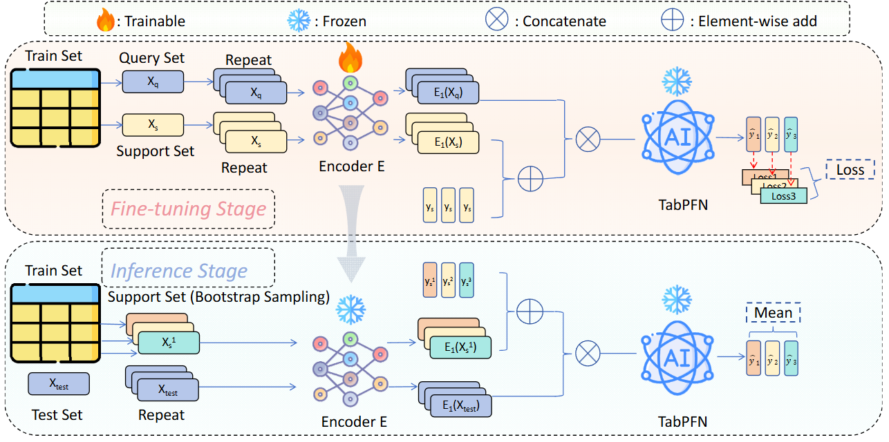

# TabPFN Unleashed: A Scalable and Effective Solution to Tabular Classification Problems





### Quick Start

To train and evaluate the model on a specific dataset:
```bash
python main.py --dataset [dataset_name]
```

Datasets are available at [Google Drive](https://drive.google.com/drive/folders/1j1zt3zQIo8dO6vkO-K-WE6pSrl71bf0z?usp=drive_link).


## Citation

If you use Beta in your research, please cite:

```bibtex
@inproceedings{LiuBeta2025,
  title={TabPFN Unleashed: A Scalable and Effective Solution to Tabular Classification Problems},
  author={Si-Yang Liu and Han-Jia Ye},
  year={2025},
  booktitle={ICML},
}
```
